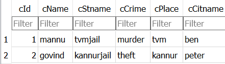
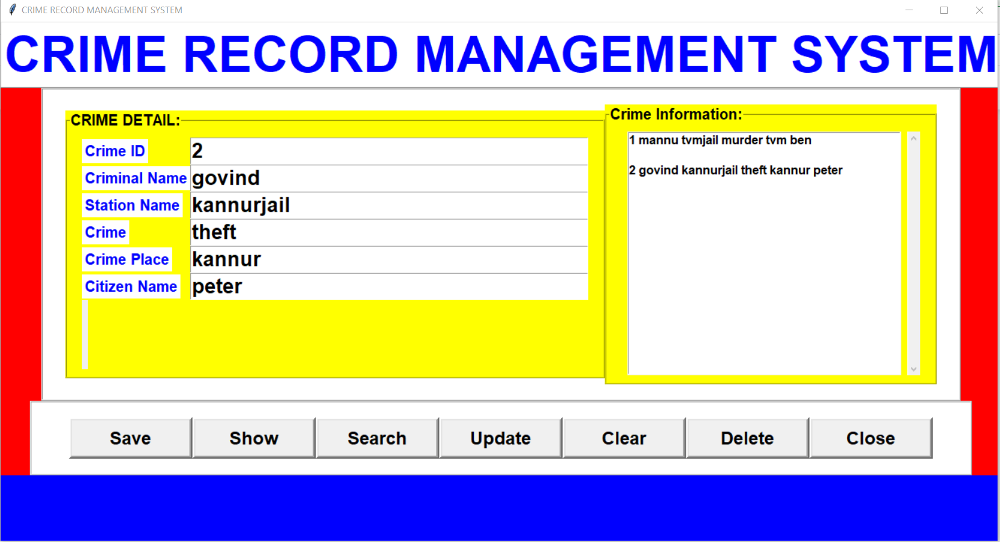

# crime-database
A python + sqlite3 database management system using tkinter(a Python GUI library)

This is a mini project done as a part of Application Software Development for B.Tech CSE under KTU.

Run this code in a <a href="https://jupyter.org/">Jupyter Notebook</a> and also connect the database (.db) file with an <a href="https://sqlitebrowser.org/dl/">SQLite Browser</a> to see the changes.

## Table viewed in SQLite

## GUI

